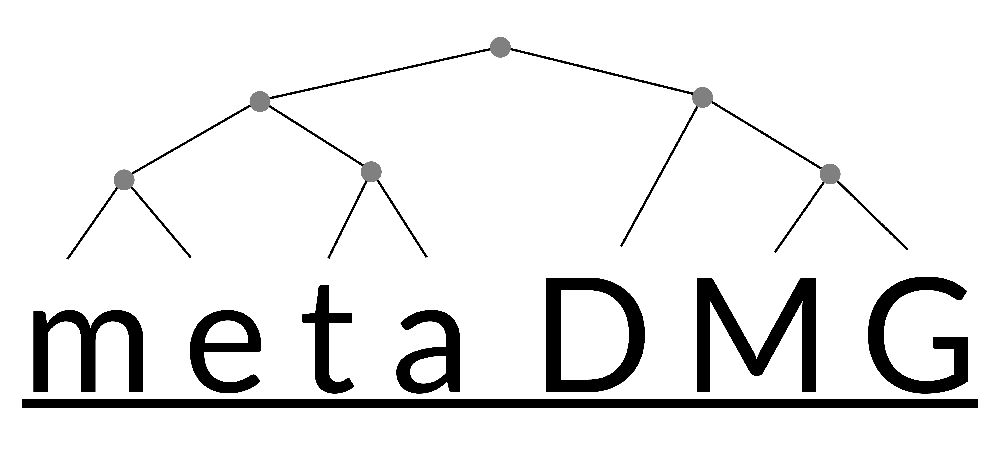

<!--
```{image} docs/source/images/logo.png
:alt: logo
:class: bg-primary
:width: 500px
:align: center
``` -->

# A fast and accurate ancient DNA damage toolkit for metagenomic data

[](https://metadmg-dev.github.io/metaDMG-core/)
[](https://metadmg.herokuapp.com/)


<!--  -->
<!--  -->
<!--  -->
<!--  -->
<!--  -->
<!--  -->

`metaDMG` is a novel framework and suite of programs for analysing large-scale genomic data especially in the context of environmental DNA. This includes state-of-the-art statistical methods for computing nucleotide misincorporation and fragmentation patterns of even highly complex samples.

For more information, see the [documentation](https://metadmg-dev.github.io/metaDMG-core).
For a quick preview of the interactivity, see the [dashboard](https://metadmg.herokuapp.com).

## Table of contents
* [Getting started](#getting-started)
* [Citing metaDMG](#citing-metadmg)

## Getting Started

For information about how to get started running `metaDMG`, see the section in the [documentation](https://metadmg-dev.github.io/metaDMG-core/getting-started.html).

## Citing `metaDMG`

Here will be more information once our paper is released.
